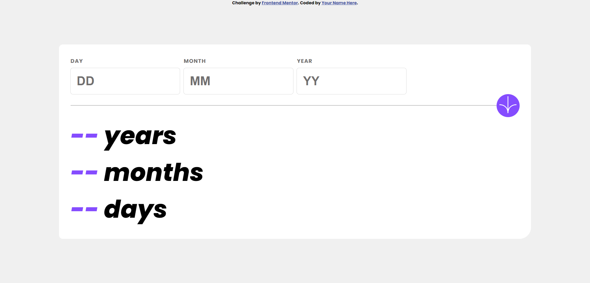
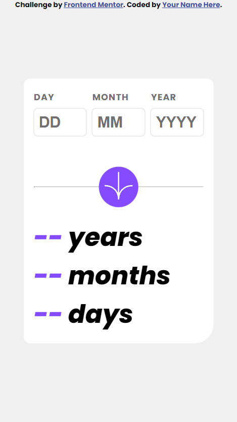

# Frontend Mentor - Age calculator app solution

This is a solution to the [Age calculator app challenge on Frontend Mentor](https://www.frontendmentor.io/challenges/age-calculator-app-dF9DFFpj-Q). Frontend Mentor challenges help you improve your coding skills by building realistic projects. 

## Table of contents

- [Overview](#overview)
  - [The challenge](#the-challenge)
  - [Screenshot](#screenshot)
  - [Links](#links)
- [My process](#my-process)
  - [Built with](#built-with)
  - [What I learned](#what-i-learned)
  - [Main Functions](#main-functions)
  - [Continued development](#continued-development)
  - [Useful resources](#useful-resources)
- [Author](#author)

## Overview

### The challenge

Users should be able to:

- View an age in years, months, and days after submitting a valid date through the form
- Receive validation errors if:
  - Any field is empty when the form is submitted
  - The day number is not between 1-31
  - The month number is not between 1-12
  - The year is in the future
  - The date is invalid e.g. 31/04/1991 (there are 30 days in April)
- View the optimal layout for the interface depending on their device's screen size
- See hover and focus states for all interactive elements on the page
- **Bonus**: See the age numbers animate to their final number when the form is submitted

### Screenshot




### Links

- Solution URL: [https://github.com/ferassmohana/age-calc](https://github.com/ferassmohana/age-calc)
- Live Site URL: [https://ferassmohana.github.io/age-calc/](https://ferassmohana.github.io/age-calc/)

## My process

### Built with

- HTML5 markup
- CSS custom properties
- Flexbox
- CSS Grid
- JS


### What I learned

In this challenge, I recaped alot of things in js:
- Form input validation and handling.
- Calculate any month's days number based on the month and the year.
- Calculate the age based on the user inptus.
- Get the current year.

### Main Functions: 

#### Function that calculate the age:
```js
function calculateAge(birthdate) {
    const today = new Date();
    const birth = new Date(birthdate);

    let years = today.getFullYear() - birth.getFullYear();
    let months = today.getMonth() - birth.getMonth();
    let days = today.getDate() - birth.getDate();

    if (months < 0 || (months === 0 && days < 0)) {
        years--;
        months += 12;
    }

    if (days < 0) {
        const lastMonthDate = new Date(today.getFullYear(), today.getMonth() - 1, birth.getDate());
        days = Math.floor((today - lastMonthDate) / (1000 * 60 * 60 * 24));
    }

    return { years, months, days };
}
```

#### Function that calculate the 
```js
function daysInMonth(month, year) {
    return new Date(year, month, 0).getDate();
}
```

#### Built-in method that store the current year in variable
```js
let currentYear = new Date().getFullYear();
```
### Continued development

After this project, I'll put much harder work on write clean, less code.
If anyone has any comment, please to don't hesitate to contact with me!

### Useful resources

- [ChatGPT](https://chat.openai.com/) - This helped reaching the right functionalty, and give examples of form validation this concept.

## Author

- Frontend Mentor - [@ferassmohana](https://www.frontendmentor.io/profile/ferassmohana)
- Facebook - [@ferassmohana](https://www.facebook.com/profile.php?id=100084166403321)
